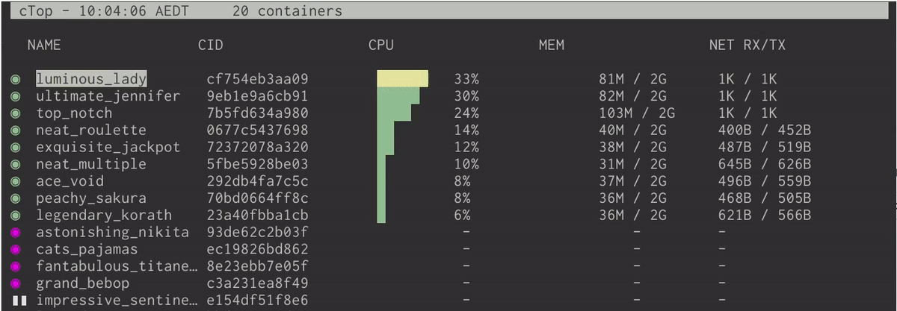

<p align="center"></p>

#

Top-like interface for container metrics

`ctop` provides a concise and condensed overview of real-time metrics for multiple containers:
<p align="center"></p>

as well as an [expanded view][expanded_view] for inspecting a specific container.

`ctop` currently comes with built-in support for Docker; connectors for other container and cluster systems are planned for future releases.

## Install

Fetch the [latest release](https://github.com/bcicen/ctop/releases) for your platform:

#### Linux

```bash
sudo wget https://github.com/bcicen/ctop/releases/download/v0.5/ctop-0.5-linux-amd64 -O /usr/local/bin/ctop
sudo chmod +x /usr/local/bin/ctop
```

#### OS X

```bash
brew install ctop
```
or
```bash
sudo curl -Lo /usr/local/bin/ctop https://github.com/bcicen/ctop/releases/download/v0.5/ctop-0.5-darwin-amd64
sudo chmod +x /usr/local/bin/ctop
```

or run via Docker:
```bash
docker run -ti --name ctop --rm -v /var/run/docker.sock:/var/run/docker.sock quay.io/vektorlab/ctop:latest
```

`ctop` is also available for Arch in the [AUR](https://aur.archlinux.org/packages/ctop-bin/)

## Building

Build steps can be found [here][build].

## Usage

`ctop` requires no arguments and will configure itself using the `DOCKER_HOST` environment variable
```bash
export DOCKER_HOST=tcp://127.0.0.1:4243
ctop
```

### Options

Option | Description
--- | ---
-a	| show active containers only
-f <string> | set an initial filter string
-h	| display help dialog
-i  | invert default colors
-r	| reverse container sort order
-s  | select initial container sort field
-v	| output version information and exit

### Keybindings

Key | Action
--- | ---
a | Toggle display of all (running and non-running) containers
f | Filter displayed containers (`esc` to clear when open)
H | Toggle ctop header
h | Open help dialog
s | Select container sort field
r | Reverse container sort order
q | Quit ctop

[build]: _docs/build.md
[expanded_view]: _docs/expanded.md
