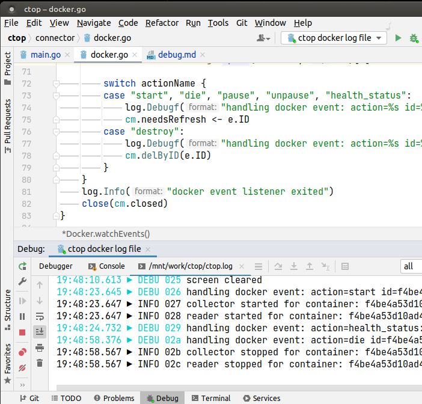

# Debug Mode

`ctop` comes with a built-in logging facility and local socket server to simplify debugging at run time.

## Quick Start

If running `ctop` via Docker, debug logging can be most easily enabled as below:
```bash
docker run -ti --rm \
           --name=ctop \
           -e CTOP_DEBUG=1 \
           -e CTOP_DEBUG_TCP=1 \
           -p 9000:9000 \
           -v /var/run/docker.sock:/var/run/docker.sock \
           quay.io/vektorlab/ctop:latest
```

Log messages can be followed by connecting to the default listen address:
```bash
curl -s localhost:9000
```

example output:
```
15:06:43.881 ▶ NOTI 002 logger initialized
15:06:43.881 ▶ INFO 003 loaded config param: "filterStr": ""
15:06:43.881 ▶ INFO 004 loaded config param: "sortField": "state"
15:06:43.881 ▶ INFO 005 loaded config switch: "sortReversed": false
15:06:43.881 ▶ INFO 006 loaded config switch: "allContainers": true
15:06:43.881 ▶ INFO 007 loaded config switch: "enableHeader": true
15:06:43.883 ▶ INFO 008 collector started for container: 7120f83ca...
...
```

## Unix Socket

Debug mode is enabled via the `CTOP_DEBUG` environment variable:

```bash
CTOP_DEBUG=1 ./ctop
```

While `ctop` is running, you can connect to the logging socket via socat or similar tools:
```bash
socat unix-connect:./ctop.sock stdio
```

## TCP Logging Socket

In lieu of using a local unix socket, TCP logging can be enabled via the `CTOP_DEBUG_TCP` environment variable:

```bash
CTOP_DEBUG=1 CTOP_DEBUG_TCP=1 ./ctop
```

A TCP listener for streaming log messages will be started on the default listen address(`0.0.0.0:9000`)

## Log to file

You can also log to a file by specifying `CTOP_DEBUG_FILE=/path/to/ctop.log` environment variable:
```sh
CTOP_DEBUG=1 CTOP_DEBUG_FILE=ctop.log ./ctop
```

This is useful for GoLand to see logs right in debug panel: 
* Edit Run configuration 
* Go to Logs tab
* Specify this log file in "Log file to be shown in console".
Then during debugging you'll see the log tab in debug panel:


